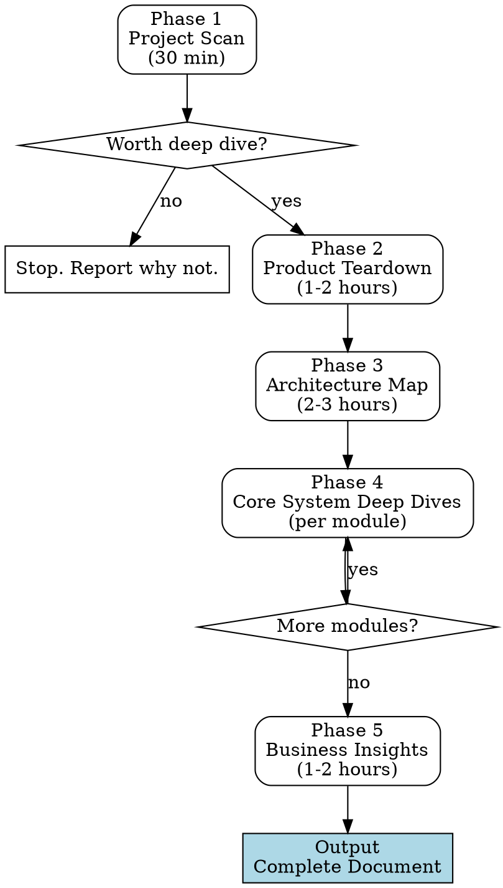

# 开源项目深度拆解（非技术人员视角）

## Overview

帮助产品经理、创始人、市场负责人深度理解一个开源项目——不是看代码，而是看产品逻辑、架构设计、竞争格局和商业机会。

**核心原则：先产品后技术。** 先问"为谁解决什么问题"，再看"怎么实现"。从产品约束推导技术方案，不是反过来。

## When to Use

- 用户想深度学习/研究一个开源项目
- 用户想评估一个开源项目的商业机会
- 用户想理解一个开源项目为什么火
- 用户想从开源项目中学习可迁移的产品/架构设计
- 用户是非技术背景（PM、创始人、市场、投资人）

**When NOT to use：**
- 用户只是想快速了解一个库的 API 用法（用文档即可）
- 用户是工程师想贡献代码（不需要产品视角的深潜）
- 项目太小（<50 个文件），不值得系统化分析

## Process Flow



---

## Phase 1: Project Scan (Quick Judgment)

**Goal:** Spend minimal time deciding if this project is worth deep study.

### 1.1 Project Vitals

| Check | How | Red Flag |
|-------|-----|----------|
| What is it? | Read README first paragraph | Can't explain in one sentence |
| Community health | Stars, forks, contributors count | <100 stars or 1 contributor |
| Active maintenance | Last commit date, release frequency | No commits in 6+ months |
| License | Check LICENSE file | GPL (limits commercial use) or no license |
| Backing | Check for commercial entity or foundation | Solo hobby project with no support |

### 1.2 Quick Product Judgment

- Read VISION / ROADMAP (if exists)
- What problem does it solve?
- Who is the target user?
- How is it different from existing solutions?
- Is it "yet another clone" or genuinely novel?

### 1.3 Community Health (deeper look)

- Issue response time (are maintainers active?)
- PR merge rate (do they accept contributions?)
- Contributor distribution (bus factor)
- Discord/community activity
- External integrations / ecosystem size

**Output:** One paragraph: "Worth deep dive because..." or "Not worth it because..."

---

## Phase 2: Product Teardown (No Code)

**Goal:** Understand the product purely from a product perspective, without looking at code.

### 2.1 Product Positioning

Ask and answer:
- Is it a tool, platform, or infrastructure?
- In what scenario does a user need it?
- What's the alternative if they don't use it?
- What's the **core differentiation** (not feature list)?
- Multi-layer positioning: surface appeal → retention hook → lock-in mechanism

### 2.2 User Persona

- Who are the current users? (Infer from docs, issues, community)
- What's their technical level?
- What would they pay for?

### 2.3 Growth Strategy

- How does it acquire users? (Open source → community spread? Channel coverage?)
- What's the growth flywheel?
- Where are the network effects?

### 2.4 Competitive Analysis

- Direct competitors
- Indirect competitors (big company features that overlap)
- Moat analysis: technical barrier? data barrier? community barrier?
- Structural blind spots of incumbents (what can't big companies do?)

**Output:** Product positioning document with competitive landscape.

**Key principle:** Discuss with the user. Ask for their intuitions. Their questions will reveal angles you missed.

---

## Phase 3: Architecture Map

**Goal:** Build a mental model — what parts exist, what each does, how they collaborate. No code reading needed, but must be able to draw the architecture.

### 3.1 Repository Structure Scan

- Use Explore agent to scan directory structure and classify by responsibility
- Identify core modules vs extensions
- Understand code scale (file count, module count)

### 3.2 Layered Understanding

- How many layers does the system have?
- What **product problem** does each layer solve?
- What happens if a layer is missing? (Validates each layer's necessity)

### 3.3 End-to-End Flow (Critical Anchor)

**This is the most important step in the entire process.**

- Choose the most typical user action
- Trace it from input to output through the entire system
- Mark which module each step passes through

This end-to-end flow becomes the **anchor** for all subsequent deep dives. When studying any module later, the user knows "where am I in the overall flow."

### 3.4 Key Design Decision Identification

- Which architectural choices were driven by "who the user is"?
- Which choices have clear trade-offs?
- What would a different user base have chosen differently?

**Output:** Architecture overview document + end-to-end flow diagram.

---

## Phase 4: Core System Deep Dives

**Goal:** Three-layer progressive understanding of each high-value module.

### 4.1 Module Selection (By Value, Not by Directory)

**Critical:** Do NOT just list modules the user mentioned. Do a comprehensive survey.

- Use Explore agent to thoroughly scan the entire codebase
- Evaluate each system's complexity and architectural uniqueness
- Rank by "product value + architectural interest + relevance to user's goals"
- Align with user: which are must-learn, which are optional
- Group into logical Parts (global model → core engines → platform capabilities → business insights)

### 4.2 Per-Module Deep Dive Process

For each module, follow this sequence:

```
a. Source Research
   → Dispatch code-explorer agent to deeply read source code
   → User does NOT need to read code themselves

b. Architecture Level: "What exists?"
   → What components does this module have?
   → How do they collaborate?
   → Key file index (for reference, not for reading)

c. Design Decision Level: "Why this way?"
   → Start from product constraints/user personas
   → Derive the technical decision from the constraint
   → Explain the trade-offs
   → NEVER: "it uses X technology" → "here's a product insight"
   → ALWAYS: "the constraint is Y" → "so they chose X" → "the trade-off is Z"

d. Data Flow Level: "How does data move?"
   → Where does data come from?
   → What transformations happen?
   → Where does it go?
   → Use a CONCRETE EXAMPLE to walk through the entire flow

e. Product Insights
   → What does this design mean for building products?
   → What patterns can be transferred to the user's own work?
   → What startup opportunities does this reveal?

f. Q&A Discussion
   → User asks questions → answer with concrete examples
   → User's questions often expose unclear areas — clarify them

g. Document
   → Consolidate into a structured reference document
```

### 4.3 Per-Module Document Structure

```
# Module N: Title

## One-line Summary
## Architecture Map (components + relationships)
## Core Data Flow (end-to-end diagram)
## Key Design Decisions (constraint → choice → trade-off)
## Product Insights (transferable patterns)
## Key File Index (for reference)
## Glossary (module-specific terms)
```

### 4.4 Interaction Principles

| Principle | Why |
|-----------|-----|
| **Concrete examples beat abstractions** | "mixed search" is unclear; walking through a specific query with scores is clear |
| **One question at a time from user** | Don't dump everything; let the user's curiosity guide depth |
| **Analogies + real tech, not all analogies** | Pure analogy feels shallow; pure tech loses non-technical users |
| **Product constraint → technical choice** | Not "it uses SQLite" but "users run on laptops so SQLite (zero server) is the only option" |
| **Every module connects to "what's in it for me"** | Product insights are not an appendix; they're a core deliverable per module |

---

## Phase 5: Business Insights

**Goal:** Transform technical understanding into business judgment.

### 5.1 Business Model Analysis

- Current monetization (if any): open-core? SaaS? services?
- a16z's three fits:
  - Project-Community Fit (are developers actively contributing?)
  - Product-Market Fit (do users genuinely need it?)
  - Value-Market Fit (can it convert to revenue?)

### 5.2 Startup Opportunity Mining

For each core module studied in Phase 4, ask:
- Can this component be an independent product?
- What vertical scenarios can use this architecture as SaaS?
- What ecosystem services are needed?
- Where are competitor gaps?

### 5.3 Risk Assessment

- Platform dependency (will platforms block access?)
- Big company risk (will incumbents build this?)
- Technical barrier assessment (how hard to replicate?)
- Willingness to pay (what would users pay for?)

### 5.4 Transferable Design Patterns

- Which design approaches can be reused in your own product?
- Not copying code — copying the "constraint → decision → trade-off" thinking

**Output:** Startup opportunity document + direction selection framework + transferable patterns.

---

## Final Output

One consolidated document containing:

```
① Project scan conclusion (worth studying or not, why)
② Product positioning teardown (what, for whom, why popular, vs competitors)
③ Architecture overview (layer diagram + end-to-end flow)
④ Core module deep dives (three-layer progressive + product insights per module)
⑤ Business insights (opportunities + risks + transferable patterns)
```

---

## Key Principles (Quick Reference)

| # | Principle | Detail |
|---|-----------|--------|
| 1 | Product before technology | Ask "for whom, what problem" before "how implemented" |
| 2 | Module selection by research | Comprehensive scan → rank by value, not "whatever user mentions" |
| 3 | End-to-end flow is the anchor | One complete user journey grounds all subsequent deep dives |
| 4 | Three-layer progressive | Architecture (what) → Design decisions (why) → Data flow (how) |
| 5 | Constraint → technical choice | Not "what tech" but "what constraint drove this tech choice" |
| 6 | Concrete examples for everything | Abstract concepts must land with specific scenarios |
| 7 | Every module → "what's in it for me" | Product/startup insights are core output, not appendix |
| 8 | User questions drive depth | Initial explanation covers breadth; follow-up questions dig deep |
| 9 | Discuss, don't lecture | Ask for user's intuitions; their questions reveal missed angles |
| 10 | All Chinese for Chinese users | Content, examples, analogies all in user's language |

## Common Mistakes

| Mistake | Fix |
|---------|-----|
| Starting with code structure | Start with product positioning |
| Only covering modules user mentioned | Do comprehensive survey, rank by value |
| Explaining technology then adding "product insight" | Start from product constraint, derive technology |
| Dumping all information at once | One module at a time, discuss before moving on |
| Using only analogies | Mix analogies with real technical concepts |
| Skipping the end-to-end flow | Always do it — it's the anchor for everything after |
| Treating product insights as optional | They're the main deliverable for non-technical users |
| Not asking for user's opinion | Their questions and pushback improve the analysis |
